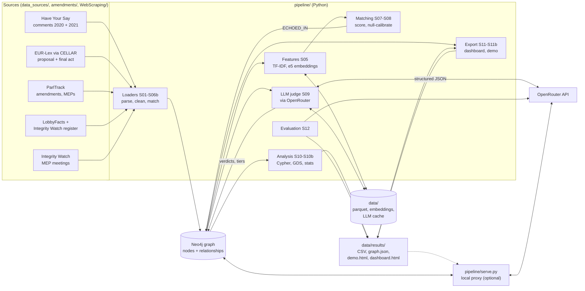
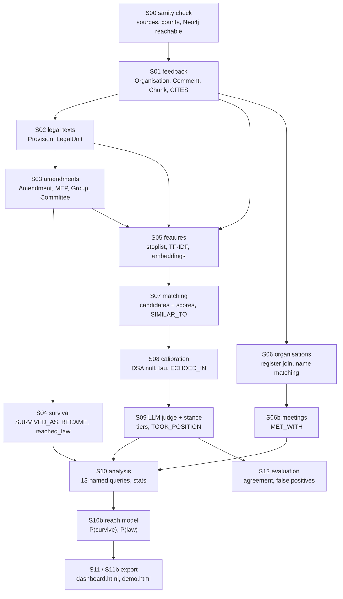
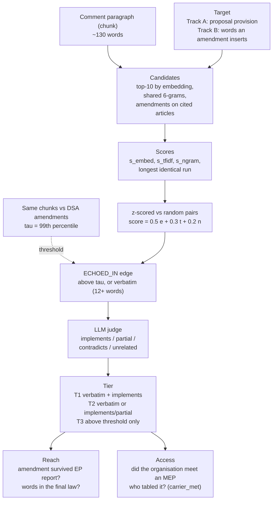
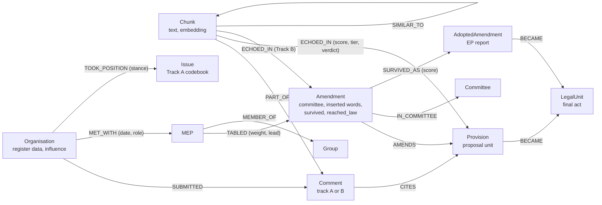
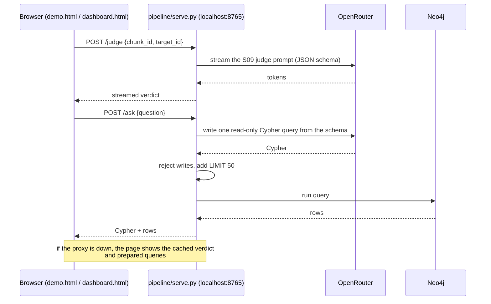

# Architecture

How the project is put together: the layers, the data flow, the graph model, and why the pipeline is built the way it is.
The [README](../README.md) is the quick tour; the step-by-step design rationale is in [IMPLEMENTATION_PLAN.md](IMPLEMENTATION_PLAN.md).

## 1. System overview

Neo4j is the working model and the single source of truth. Python loads every source into it as nodes and relationships,
does the heavy numeric work (similarity, LLM judging) outside the database, and writes the results back as relationships.
Analysis then runs as Cypher and Graph Data Science, and the demo reads exports of the graph.

## 2. The pipeline, stage by stage

Each stage is a module in `pipeline/` with a `main(track)` function, run in order by `python -m pipeline.run`.
Loads are idempotent (`MERGE` on a unique key, batches of 1,000), and every node and relationship carries `source` and `run_id`,
so a stage can be wiped and reloaded.

| Stage | What it does | Main output | Key decision |
|---|---|---|---|
| S00 | Checks every source in `sources.yaml`, counts rows, checks Neo4j and plugins, applies `schema.cypher` | console report | warns, never blocks |
| S01 | Loads Have Your Say comments; re-chunks to ~80-150-word paragraphs; strips boilerplate; parses cited articles | `Organisation`, `Comment`, `Chunk`, `CITES` | Track A gets no `CITES` (comments predate the proposal) |
| S02 | Parses EUR-Lex HTML into units: recitals, articles, paragraphs, points, annexes | `Provision` (proposal), `LegalUnit` (final act) | unit ids follow ParlTrack (`Art5(1)(d)`); final-act articles come from the 2026 consolidation, recitals and "as adopted" text from the 2024 OJ |
| S03 | Loads the 4,852 committee amendments | `Amendment`, `MEP`, `Group`, `Committee`, `AMENDS`, `TABLED` | `added_text` keeps only the words an amendment inserts; `TABLED.weight` = 1 / co-signers |
| S04 | Follows amendments into the EP report and the final act | `AdoptedAmendment`, `SURVIVED_AS`, `BECAME`, `survived`, `reached_law` | survival scored on the inserted wording only; thresholds are 99th percentiles of null scores |
| S05 | Proposal 6-gram stoplist, TF-IDF, `multilingual-e5-base` embeddings | `data/features/`, `Chunk.embedding` | stoplist applies to Track B only |
| S06 | Joins organisations to LobbyFacts and the Integrity Watch register | org properties (spend, FTE, passes, meetings) | register number first, then strict name rules; uncertain stays unmatched, spend never imputed |
| S06b | Matches the free-text `lobbyists` field of MEP meetings to consultation organisations | `MET_WITH`, `MEP` (meeting-only) | covers 2020 and Jun-Oct 2024 only; missing means "not recorded" |
| S07 | Candidate (chunk, target) pairs and scores; near-duplicate chunks | `s07_candidates_*.parquet`, `SIMILAR_TO` | widely shared 12-grams (>= 8 organisations) are masked |
| S08 | Scores the same chunks against the DSA amendments; threshold = 99th percentile | `ECHOED_IN` (above threshold + verbatim), `carrier_met` | verbatim runs that also occur against the DSA are flagged as shared legal text |
| S09 | LLM judges each echo; codes Track A stances and the proposal's choices | `llm_relation`, `llm_direction`, `tier`, `TOOK_POSITION`, `Issue` | cheap models; invalid JSON falls back to a stronger model |
| S10 | Runs `neo4j/queries/*.cypher` plus GDS and Python statistics | `data/results/*.csv` | per-amendment funnel, Spearman with bootstrap CIs, permutation baselines |
| S10b | Logistic models for P(survive) and P(reach the law) | `Amendment.p_*`, `reach_model.csv` | trained on all committee amendments; shows which features push a probability up or down |
| S11 / S11b | Exports `graph.json`, an analysis dashboard and the multi-page demo | `dashboard.html`, `demo.html` | single self-contained files |
| S12 | Cross-model agreement, null false-positive rate, verbatim sanity, stance stability | `eval.csv`, `eval/labels.csv` | different model families so agreement means something |

## 3. How an "echo" is found and judged

The core idea: a comment paragraph *echoes* a provision or amendment when its wording reappears there more than chance allows,
and an LLM then confirms it. Scores are always compared with an unrelated act so "similar" has a baseline.

Why each safeguard exists:

- **Proposal stoplist** (Track B): comments and amendments both quote the proposal, so shared 6-grams from it are not evidence.
- **Shared-quote masking**: a title or definition quoted by many organisations (the White Paper, the OECD AI definition) says nothing about one lobby.
- **DSA null**: the same chunks scored against a neighbouring digital act give a realistic "chance" level.
- **LLM judge on top, never alone**: it only refines pairs that already passed the statistical threshold.
- **Access is reported next to the tier**, never folded into it, because the meetings data has a gap (2021 to mid-2024).

## 4. Graph model

Uniqueness constraints per node key are in `neo4j/schema.cypher`; vector indexes on `Chunk`, `Provision` and `Amendment` embeddings let
Neo4j find similar text directly. The full property list is in [IMPLEMENTATION_PLAN.md](IMPLEMENTATION_PLAN.md) section 1.

## 5. Where data lives

| Location | Contents | In git |
|---|---|---|
| `data_sources/`, `amendments/*.zst`, `WebScraping/feedback/` | raw inputs (ParlTrack dumps are large and ignored) | partly |
| Neo4j volume (`neo4j/data/`) | the graph | no |
| `data/cache/` | parquet tables written by loaders (S01-S04, S06, S07-S09) | no |
| `data/features/` | embeddings, TF-IDF, stoplist | no |
| `data/llm_cache.sqlite`, `data/llm_costs.csv` | every LLM answer by prompt hash; token and cost log | no |
| `data/results/` | CSVs, `graph.json`, `dashboard.html`, `demo.html` | no |
| `.env` | Neo4j password, `OPENROUTER_API_KEY`, model names | no (never committed) |

## 6. Live demo path

The pages are static; only two buttons need a server. The local proxy holds the API key, so it never sits in the HTML.

## 7. Design choices worth knowing

- **Graph-first**: every source becomes nodes and relationships; analysis is a Cypher query, so any result can be traced to its evidence.
- **Numbers outside, results inside**: embeddings, n-gram indexes and TF-IDF are cached in `data/`; only results go into Neo4j.
- **Everything automatic, nothing hand-labelled**: matches carry `match_method` and a confidence, thresholds come from null distributions,
  and evaluation uses cross-model agreement. Anything uncertain stays unmatched or lower-tier.
- **Cheap, cached, replaceable LLMs**: one client (`pipeline/llm.py`) for all steps, JSON-schema output, retries with backoff,
  a sqlite cache so re-runs and the demo cost nothing, and models swapped through `.env`.
- **Honest labels**: register figures are the 2026 snapshot, meetings cover 2020 and Jun-Oct 2024 only, and "echo" means similar wording, not proof of influence.
