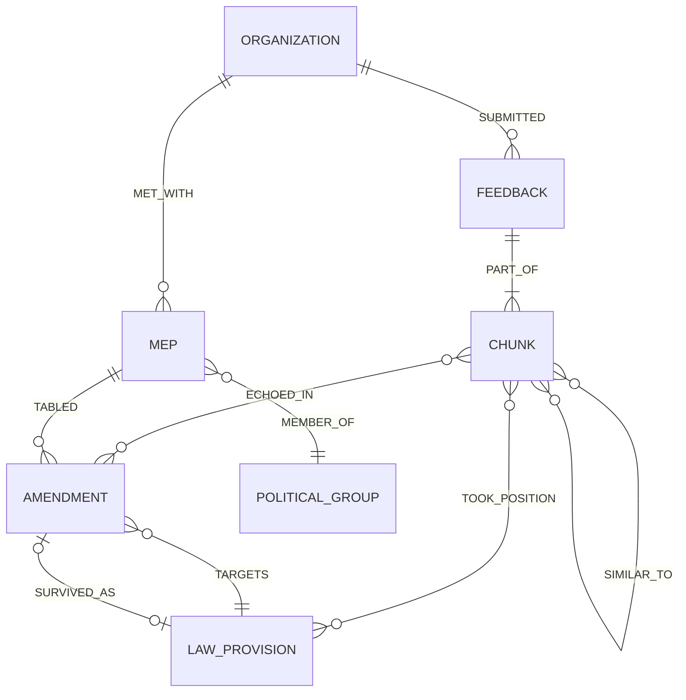

# Struttura del Grafo Neo4j (Reversa AI)

Questa struttura sostituisce il modello precedente, integrando direttamente i nuovi dati scoperti: **LobbyFacts** (budget, pass), **IntegrityWatch** (incontri MEP-Lobby), i **Feedback di HaveYourSay** estratti, e gli **Emendamenti** del Parlamento Europeo.



## 1. Nodi e Proprietà

### 🏢 `Organization` (Lobby / ONG / Azienda)
Unifica i dati da *HaveYourSay*, *LobbyFacts* e *IntegrityWatch* tramite il **Transparency Register ID**.
* `org_id` (String): ID del Registro per la Trasparenza (es. "56047191389-84").
* `name` (String): Nome dell'organizzazione.
* `user_type` (String): Categoria (es. `NGO`, `COMPANY`, `TRADE_UNION`, da HYS/IntegrityWatch).
* `country` (String): Nazione della sede.
* `lobbying_costs_eur` (Float): Budget speso (da *LobbyFacts*).
* `fte` (Float): Full-Time Equivalents (da *LobbyFacts*).
* `ep_passes` (Integer): Numero di pass per il Parlamento (da *LobbyFacts*).

### 🗣️ `Feedback`
L'intera sottomissione alla consultazione.
* `publication_id` (Integer): ID (es. 13340 o 14488).
* `stage_name` (String): Fase (es. "STAGE_1_INCEPTION_FEEDBACK").
* `date` (Date): Data di sottomissione.

### 🧩 `Chunk`
I paragrafi/frasi atomici estratti dai PDF o dal testo del Feedback.
* `chunk_id` (String): UUID univoco.
* `text` (String): Il testo del paragrafo (indispensabile per la demo e l'analisi LLM).
* `embedding` (List of Floats): Vettore semantico del testo, necessario per calcolare le similarità (Vector Search in Neo4j).
* `source_type` (String): "form_text" o "attachment".

### 🏛️ `MEP` (Membro del Parlamento Europeo)
Da *IntegrityWatch* e *ParlTrack* (Amendments).
* `ep_id` (String): ID univoco del parlamentare.
* `name` (String): Nome completo.
* `country` (String): Nazione di elezione.

### 🟡 `PoliticalGroup`
* `group_id` (String): Sigla del gruppo (es. EPP, S&D, Renew, Greens).

### 📝 `Amendment`
Dal dataset ParlTrack (gli emendamenti depositati).
* `am_id` (String): ID dell'emendamento.
* `date` (Date): Data di deposito.
* `committee` (String): Commissione (es. IMCO/LIBE).
* `old_text` (String): Testo originale.
* `new_text` (String): Testo proposto.
* `reached_law` (Boolean): Se è passato nella legge finale.

### ⚖️ `LawProvision` (Articoli, Recital, Allegati)
Dal dataset EUR-Lex (proposal_units e final_units).
* `unit_id` (String): ID gerarchico (es. "Art. 5(1)(a)").
* `text` (String): Il testo normativo.
* `is_final_law` (Boolean): True se appartiene alla legge finale approvata, False se è la proposta iniziale della Commissione.

---

## 2. Relazioni (Edges)

| Relazione | Origine → Destinazione | Proprietà | Significato |
| :--- | :--- | :--- | :--- |
| **`SUBMITTED`** | `Organization` → `Feedback` | - | L'organizzazione ha inviato questo feedback. |
| **`PART_OF`** | `Chunk` → `Feedback` | `order` (Int) | Mantiene l'ordine dei paragrafi nel documento. |
| **`ECHOED_IN`** | `Chunk` → `Amendment` | `score` (Float), `tier` (String, es. 'T1'), `llm_direction` (String: 'supports'/'opposes'), `overlap_quote` (String) | L'LLM ha rilevato che la richiesta della lobby si riflette in questo emendamento. |
| **`MET_WITH`** | `Organization` → `MEP` | `date` (Date), `dossier` (String), `location` (String) | Incontro registrato da IntegrityWatch. |
| **`TABLED`** | `MEP` → `Amendment` | `is_lead_author` (Bool) | Il MEP ha firmato o guidato l'emendamento. |
| **`MEMBER_OF`** | `MEP` → `PoliticalGroup` | - | Appartenenza politica del MEP al momento del deposito. |
| **`TARGETS`** | `Amendment` → `LawProvision` | - | L'emendamento tenta di modificare questo specifico articolo/recital. |
| **`SURVIVED_AS`** | `Amendment` → `LawProvision` | `survival_score` (Float) | Mappa l'emendamento depositato al testo della legge finale. |
| **`SIMILAR_TO`** | `Chunk` → `Chunk` | `score` (Float) | Due organizzazioni hanno copiato/incollato o scritto la stessa cosa. |
| **`TOOK_POSITION`**| `Chunk` → `LawProvision` | `stance` (String), `proposal_choice` (String) | (Track A) Il chunk prende una posizione chiara su un articolo. |

---

## 3. Implementazione delle Metriche (Cypher)

Come questa struttura risponde ai requisiti di *IMPLEMENTATION_PLAN.md*:

**2. Reach Funnel (L'efficacia del lobbying fino alla legge)**
```cypher
MATCH (o:Organization {user_type: 'NGO'})-[:SUBMITTED]->(:Feedback)<-[:PART_OF]-(c:Chunk)
// 1. Quanti chunk hanno generato un'eco in un emendamento?
OPTIONAL MATCH (c)-[e:ECHOED_IN]->(a:Amendment)
// 2. Quanti di questi emendamenti sono sopravvissuti?
OPTIONAL MATCH (a)-[:SURVIVED_AS]->(lp:LawProvision {is_final_law: true})
RETURN count(DISTINCT c) AS total_chunks, 
       count(DISTINCT e) AS echoes,
       count(DISTINCT lp) AS law_impacts
```

**3. Carriers (Quali MEP/Gruppi "portano" le istanze di chi)**
```cypher
MATCH (o:Organization)-[:SUBMITTED]->(:Feedback)<-[:PART_OF]-(:Chunk)-[:ECHOED_IN]->(a:Amendment)<-[:TABLED]-(m:MEP)-[:MEMBER_OF]->(g:PoliticalGroup)
RETURN o.name AS Lobby, m.name AS MEP, g.group_id AS Group, count(a) AS Am_Tabled
ORDER BY Am_Tabled DESC
```

**5. Coalitions (Copiatura di chunk tra lobby)**
```cypher
MATCH (o1:Organization)-[:SUBMITTED]->(:Feedback)<-[:PART_OF]-(c1:Chunk)
MATCH (o2:Organization)-[:SUBMITTED]->(:Feedback)<-[:PART_OF]-(c2:Chunk)
MATCH (c1)-[s:SIMILAR_TO]->(c2)
WHERE id(o1) < id(o2) AND s.score > 0.85
RETURN o1.name, o1.user_type, o2.name, o2.user_type, s.score
```

**6. Battlegrounds (Lobby contrapposte sullo stesso emendamento/articolo)**
```cypher
MATCH (o1:Organization)-[:SUBMITTED]->(:Feedback)<-[:PART_OF]-(c1:Chunk)
      -[e1:ECHOED_IN {llm_direction: 'supports'}]->(a:Amendment)-[:TARGETS]->(lp:LawProvision)
MATCH (o2:Organization)-[:SUBMITTED]->(:Feedback)<-[:PART_OF]-(c2:Chunk)
      -[e2:ECHOED_IN {llm_direction: 'opposes'}]->(a)
WHERE o1.user_type <> o2.user_type
RETURN lp.unit_id AS Article, o1.user_type AS Proponent, o2.user_type AS Opponent
```

**7. Money vs Influence (Correlazione risorse e successo)**
```cypher
MATCH (o:Organization)
OPTIONAL MATCH (o)-[:SUBMITTED]->(:Feedback)<-[:PART_OF]-(:Chunk)-[e:ECHOED_IN]->(a:Amendment)
WITH o, count(e) as influence_score
RETURN o.name, o.lobbying_costs_eur, o.fte, o.ep_passes, influence_score
ORDER BY influence_score DESC
```
